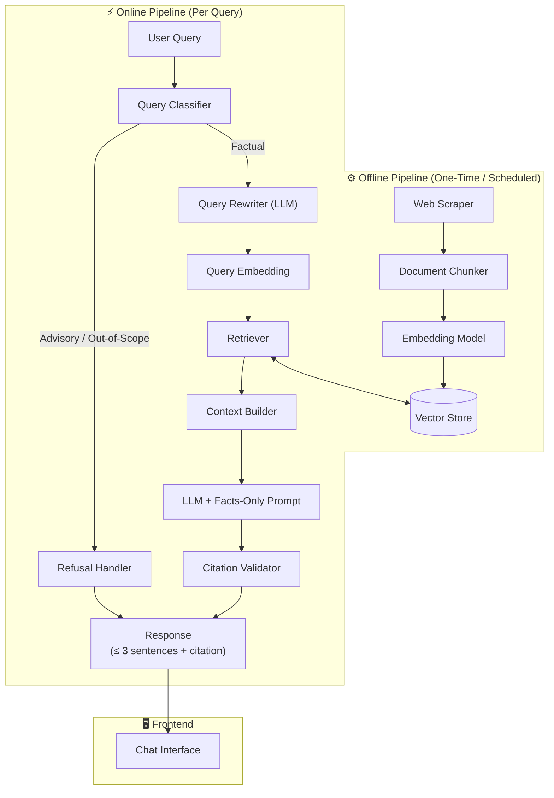
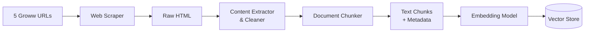
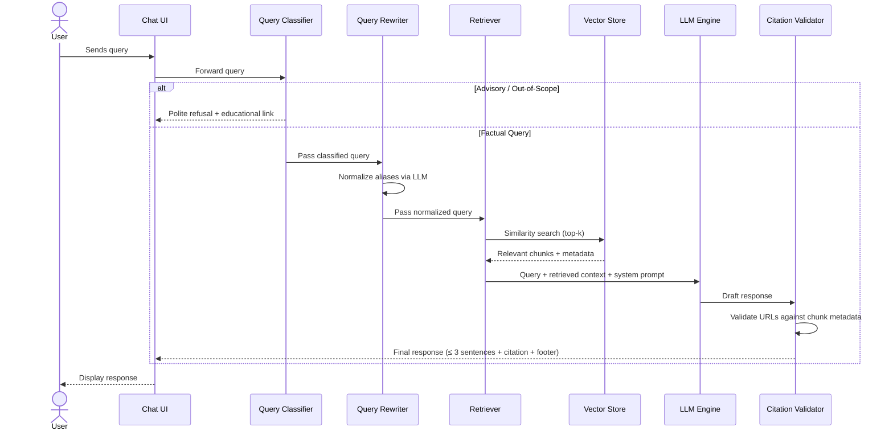
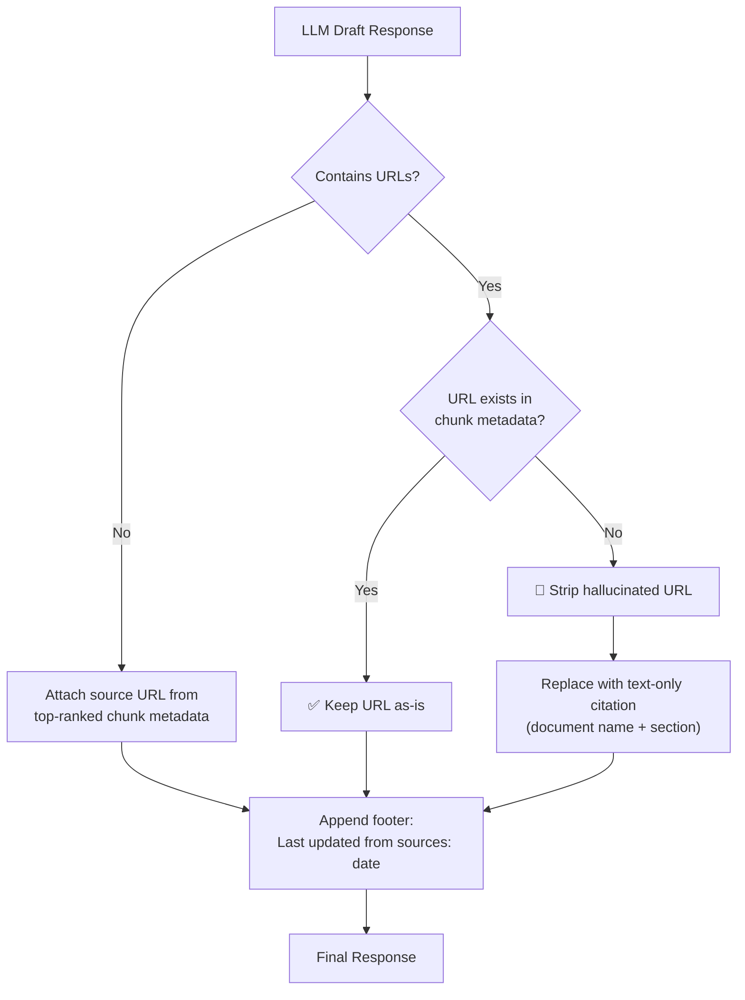
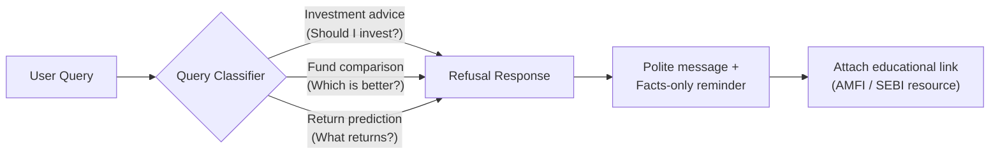
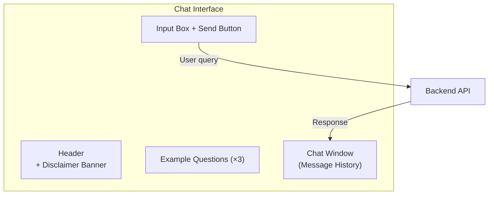
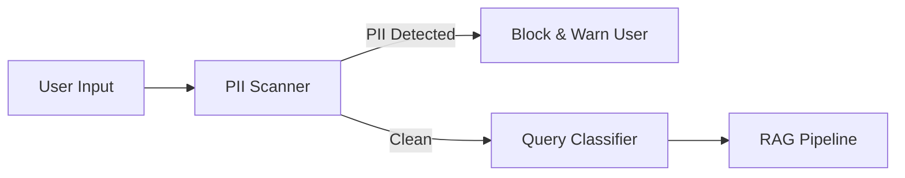
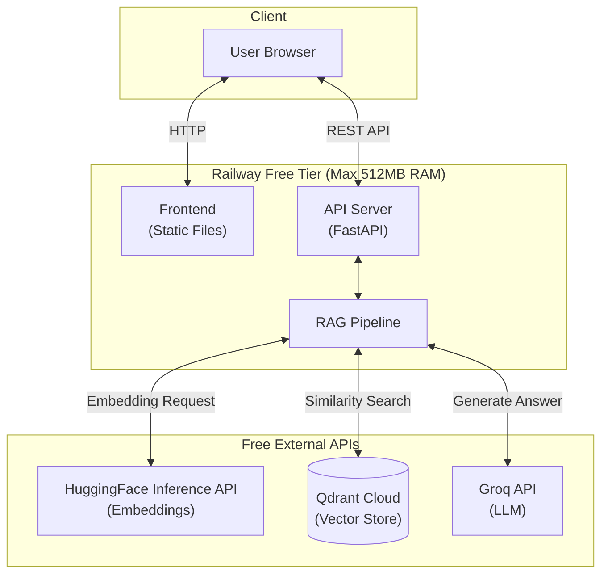

# Architecture — Mutual Fund FAQ Assistant

> **Last Updated: 20-Jun-2026** — Railway Free Plan Migration.
> Migrated to a dual-mode architecture (Local vs Cloud API) to fit within Railway's 512MB RAM and 500MB storage limits.
> See section 1b for details on the switch to HuggingFace Inference API and Qdrant Cloud.
> 
> **Previous Update: 11-Jun-2026** — Post-implementation bug-fix update.
> See [Fix.txt](file:///d:/RAG%20Chatbot/Docs/Fix.txt) for the 11-Jun-2026 change log.

## 1. System Overview

A lightweight **RAG (Retrieval-Augmented Generation)** system that ingests content from 5 pre-approved Groww URLs for HDFC mutual fund schemes, indexes them into a vector store, and serves facts-only answers through a minimal chat interface.



---

## 1a. Post-Implementation Updates (11-Jun-2026)

> [!IMPORTANT]
> The following changes were made after real-world Q&A testing revealed that the bot was incorrectly returning
> *"I don't have this information"* for valid factual questions. Full details in [Fix.txt](file:///d:/RAG%20Chatbot/Docs/Fix.txt).

### What Was Found During Testing
Six test questions were run against the deployed bot. Four of them failed — not because the data was missing from the database, but because bugs in the classifier, retriever, and configuration were silently blocking or discarding valid answers before the LLM ever saw them.

### Changes Made

| # | Component | File | What Changed | Why |
|---|---|---|---|---|
| 1 | **Query Classifier** | `pipeline/query_classifier.py` | Removed overly broad advisory keywords (`best`, `better`, `invest`, `buy`, `sell`, `which fund`). Replaced with specific multi-word phrases (`should i invest`, `which is best`, `best fund`, `buy or sell`). Added 14 new factual keywords (`tell me`, `how long`, `withdraw`, `allocation`, `portfolio`, `scheme`, `factsheet`, etc.) | Single-word triggers were blocking perfectly factual questions. E.g. *"I want to invest — what is the expense ratio?"* was refused as advisory because the word `invest` appeared. |
| 2 | **Fund Alias Routing** | `pipeline/retriever.py` | Added popular Groww display-name aliases to `SCHEME_ROUTING_MAP`: `"top 100"` → Large Cap Fund, `"opportunities"` → Mid Cap Fund. Removed risky single-word keys (`mid`, `large`, `small`, `etf`) that could match unrelated words | Users type Groww display names like *"HDFC Top 100 Fund"* and *"HDFC Mid-Cap Opportunities Fund"*. The database stores official AMC names. Without the alias map, the retriever searched across all 5 funds randomly and returned nothing or the wrong fund. |
| 3 | **Similarity Threshold** | `config.py` | Lowered `similarity_threshold` from **0.5 → 0.35** | The `BAAI/bge-large-en-v1.5` model returns scores of 0.35–0.65 for genuinely relevant but naturally phrased queries. A threshold of 0.5 was discarding half of all valid search results before the LLM could see them. |
| 4 | **LLM System Prompt** | `pipeline/generator.py` | Softened Rule 5 to allow simple logical inference (e.g. *"30 days is within 1 year, so exit load applies"*). Updated Rule 7 to explicitly tell the LLM that *"Top 100"* = Large Cap Fund and *"Mid-Cap Opportunities"* = Mid Cap Fund. | The original strict prompt caused the LLM to refuse answering even when the answer was clearly derivable from the context. |

---

## 1b. Railway Free Plan Architecture Migration (20-Jun-2026)

> [!NOTE]
> **Why we made this change:**
> The original architecture relied on local heavyweights: `sentence-transformers` for embeddings (~1.3 GB RAM, ~1.5 GB Ephemeral Disk) and `ChromaDB` for the vector store (~543 MB Persistent Disk). 
> When attempting to deploy to the **Railway Free Plan**, we hit hard ceilings: Max 512 MB RAM, Max 512 MB Persistent Volume, and Max 1 GB Ephemeral Disk. Furthermore, Railway prohibits background cron jobs (`APScheduler`), and running Playwright (Chromium) requires too much RAM and disk.

To solve this without paying for servers, the architecture was upgraded to a **Dual-Mode System**:

| Component | Local Mode (Development) | Railway Mode (Production) | Reason for Change |
|---|---|---|---|
| **Embeddings** | `sentence-transformers` (Local) | **HuggingFace Inference API** | Eliminates 1.3 GB RAM and disk usage. Both use `BAAI/bge-large-en-v1.5` so retrieval quality is identical. 100% Free. |
| **Vector Store** | `ChromaDB` (Local Disk) | **Qdrant Cloud** | Eliminates 543 MB persistent disk usage. Qdrant provides a 1GB RAM / 4GB disk cluster 100% Free. |
| **Scraping** | Runs via Playwright | **Disabled on Railway** | Railway's 512MB RAM cannot support headless Chrome. Data ingestion runs locally; Railway only serves the API. |
| **Scheduler** | `APScheduler` daily cron | **Disabled on Railway** | Railway Free Plan prohibits background cron jobs. Updates must be pushed manually. |

The application dynamically switches modes using `.env` variables (`EMBEDDING_PROVIDER` and `VECTOR_DB_PROVIDER`).

## 2. Component Architecture

### 2.1 Offline Pipeline — Corpus Ingestion

Runs once at setup (and optionally on a schedule to refresh data).



| Component | Responsibility | Details |
|---|---|---|
| **Web Scraper** | Fetch raw HTML from the 5 pre-approved URLs | Handles dynamic content if Groww uses client-side rendering (headless browser or API-based) |
| **Content Extractor** | Strip HTML, extract structured data (expense ratio, exit load, fund manager, AUM, etc.) | Preserves source URL as metadata on every extracted block |
| **Document Chunker** | Split cleaned content into retrieval-friendly chunks | Chunk size: ~300–500 tokens with overlap; each chunk retains its source URL |
| **Embedding Model** | Convert text chunks into vector embeddings | Dual-mode: Local `sentence-transformers` OR `HuggingFace Inference API`. Both use `BAAI/bge-large-en-v1.5` (1024-dim). |
| **Vector Store** | Store and index embeddings for fast similarity search | Dual-mode: Local `ChromaDB` OR `Qdrant Cloud` free tier. |

#### Chunk Metadata Schema

Each chunk stored in the vector store carries metadata to support citation integrity:

```json
{
  "chunk_id": "hdfc-midcap-003",
  "text": "The expense ratio of HDFC Mid Cap Fund Direct Growth is 0.74%...",
  "source_url": "https://groww.in/mutual-funds/hdfc-mid-cap-fund-direct-growth",
  "scheme_name": "HDFC Mid Cap Fund – Direct Growth",
  "section": "Fund Details",
  "scraped_at": "2026-06-02T00:00:00Z"
}
```

---

### 2.2 Online Pipeline — Query Processing

Handles each user query in real time.



| Component | Responsibility | Details |
|---|---|---|
| **Query Classifier** | Detect whether query is factual or advisory/out-of-scope | Keyword-based heuristic classification. Advisory check runs first using specific multi-word phrases only. Factual keyword list covers 30+ natural-language patterns. *(Updated 11-Jun-2026 — see Fix.txt)* |
| **Query Rewriter** | Normalize user query | Uses LLM to replace slang and aliases with official fund names before retrieval. |
| **Retriever** | Find the most relevant chunks for the user's question | Cosine similarity search with fund-alias routing. Retrieves top-k=4 chunks; applies `scheme_name` metadata filter when a fund keyword or alias is detected in the query. *(Updated 11-Jun-2026 — see Fix.txt)* |
| **LLM Engine** | Generate a concise, facts-only answer from retrieved context | xAI Grok-3-mini via OpenAI-compatible SDK; strict system prompt (≤ 3 sentences, no advice, no fabricated data, allows simple logical inference). *(Updated 11-Jun-2026 — see Fix.txt)* |
| **Citation Validator** | Ensure all URLs in the response exist verbatim in retrieved chunk metadata | **Zero-generation policy**: if URL not found in metadata → replace with text-only citation |
| **Refusal Handler** | Return polite refusal for advisory queries | Includes the reason for refusal + an educational link (AMFI/SEBI) |

---

### 2.3 Citation Validation Flow

A dedicated post-processing step that enforces the zero-hallucination link policy.



> [!IMPORTANT]
> The LLM must **never** generate, infer, or construct URLs. All hyperlinks in the final response are **extracted verbatim** from the `source_url` field in chunk metadata. If no verified URL is available, the system falls back to a **text-only citation** (scheme name + section title).

---

### 2.4 Refusal Handling Flow



**Example refusal response:**
> *"I can only provide factual information about mutual fund schemes. For investment guidance, please consult a SEBI-registered advisor or visit [amfiindia.com](https://www.amfiindia.com)."*

---

## 3. Data Flow Summary

| Stage | Input | Output | Key Constraint |
|---|---|---|---|
| **Scraping** | 5 Groww URLs | Raw HTML | Only pre-approved URLs |
| **Extraction** | Raw HTML | Structured text + metadata | Source URL preserved per block |
| **Chunking** | Structured text | Chunks (~250 tokens, 30-token overlap) | Section-aware; each chunk is self-contained |
| **Embedding** | Text chunks | Vector embeddings (1024-dim) | Deterministic, reproducible |
| **Indexing** | Vectors + metadata | Vector store entries | Metadata includes `source_url`, `scraped_at` |
| **Retrieval** | User query vector | Top-4 chunks above similarity ≥ 0.35 | Cosine similarity with alias-aware fund routing *(threshold lowered 11-Jun-2026)* |
| **Generation** | Query + context | Draft response | ≤ 3 sentences, facts only, logical inference allowed *(prompt updated 11-Jun-2026)* |
| **Citation Check** | Draft response + metadata | Validated response | Zero-generation URL policy |

---

## 4. Frontend Architecture

A minimal, single-page chat interface.



| Element | Description |
|---|---|
| **Disclaimer Banner** | Persistent: *"Facts-only. No investment advice."* |
| **Welcome Message** | Greets the user, explains the assistant's scope |
| **Example Questions** | 3 clickable sample queries to guide first-time users |
| **Chat Window** | Scrollable message history with user/assistant bubbles |
| **Input Box** | Text input with send button; no file uploads or attachments |

---

## 5. Technology Stack (Recommended)

| Layer | Technology | Notes |
|---|---|---|
| **Frontend** | HTML/CSS/JS | Minimal chat UI |
| **Backend / API** | Python (FastAPI) | Handles query processing, RAG orchestration |
| **Web Scraping** | BeautifulSoup + Playwright | Playwright for JS-heavy Groww pages |
| **Embedding Model** | `BAAI/bge-large-en-v1.5` | **Dual-mode**: `sentence-transformers` (local) or `HuggingFace Inference API` (Railway). Zero cost. |
| **Vector Store** | ChromaDB / Qdrant Cloud | **Dual-mode**: `ChromaDB` for local persistence, `Qdrant Cloud` for remote zero-cost hosting. |
| **LLM** | Local open-source model (Llama 3 / Qwen 2.5) via Ollama | Runs locally, zero API cost; system prompt enforces constraints |
| **Orchestration** | LangChain | Simplifies RAG pipeline wiring |

---

## 6. Security & Privacy Architecture



> [!CAUTION]
> The system must **never** collect, store, or process PAN, Aadhaar, account numbers, OTPs, emails, or phone numbers. A PII scanner at the input layer should detect and block such data before it enters the pipeline.

| Guardrail | Implementation |
|---|---|
| **Input PII filtering** | Regex-based scanner for PAN, Aadhaar patterns, emails, phone numbers |
| **No persistent user data** | Chat history is session-only; no database storage of user queries |
| **Source-only URLs** | Citation validator prevents injection of arbitrary external links |
| **Content boundary enforcement** | System prompt + query classifier block advisory content |

---

## 7. Deployment View

> [!NOTE] 
> **Legacy Deployment View (Pre-Railway Migration)**
> > ```mermaid
> > flowchart TB
> >     subgraph Server["Application Server (Heavy)"]
> >         API["API Server (FastAPI)"]
> >         RAG["RAG Pipeline"]
> >         VS[("Local Vector Store\n(ChromaDB)")]
> >     end
> > ```
> > *The above design was abandoned for production because it required >1.5GB RAM and >500MB disk, exceeding Railway's free limits.*

### Current Dual-Mode Deployment View (Railway + Cloud Services)

To fit within the 512 MB RAM limit, the heavy components were offloaded to free cloud APIs.



---

## 8. References

| Document | Description |
|---|---|
| [problemStatement.md](file:///d:/RAG%20Chatbot/Docs/problemStatement.md) | Full problem statement with scope, constraints, and deliverables |
| [context.md](file:///d:/RAG%20Chatbot/Docs/context.md) | Project context — what, why, corpus, guardrails, and success criteria |
| [implementation-plan.md](file:///d:/RAG%20Chatbot/Docs/implementation-plan.md) | Phased implementation plan with tasks, acceptance criteria, and test matrix |
| [Fix.txt](file:///d:/RAG%20Chatbot/Docs/Fix.txt) | Bug-fix log (11-Jun-2026) — before/after explanation for all 4 pipeline changes made after real-world Q&A testing |
