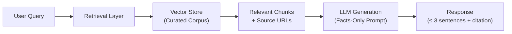

# Project Context — Mutual Fund FAQ Assistant

## 1. What Is This Project?

A **Retrieval-Augmented Generation (RAG)** chatbot that answers **facts-only** questions about HDFC mutual fund schemes. It uses **Groww** as the reference product context and retrieves information exclusively from official, pre-approved source URLs — never from third-party blogs or aggregators.

> *"Facts-only. No investment advice."*

---

## 2. Why Does This Project Exist?

| Problem | How This Project Solves It |
|---|---|
| Retail investors struggle to find **verified, concise** mutual fund details across scattered sources | Centralizes factual answers from official URLs into a single conversational interface |
| Customer support teams repeatedly answer the **same factual queries** (expense ratio, exit load, SIP minimums, etc.) | Automates responses to high-frequency, low-complexity questions |
| LLMs are prone to **hallucinating URLs** and generating unreliable financial data | Enforces a **zero-generation link policy** — all URLs must come verbatim from retrieved context |
| Users may unknowingly receive **investment advice** from generic chatbots | Hard guardrails ensure the assistant **refuses** all advisory or opinion-based queries |

---

## 3. Technical Approach

### RAG Pipeline Summary

| Stage | Details |
|---|---|
| **Corpus Ingestion** | Scrape and chunk content from 5 pre-approved Groww URLs (HDFC schemes) |
| **Embedding & Indexing** | Convert chunks into vector embeddings; store in a vector database |
| **Retrieval** | On each user query, retrieve the top-k most relevant chunks |
| **Generation** | Feed retrieved context + user query to the LLM with a strict facts-only system prompt |
| **Citation** | Extract source URL **verbatim** from the retrieved chunk; never let the LLM generate links |

---

## 4. Selected AMC & Corpus

**AMC**: HDFC Mutual Fund

| # | Scheme | Source URL |
|---|---|---|
| 1 | HDFC Mid Cap Fund – Direct Growth | https://groww.in/mutual-funds/hdfc-mid-cap-fund-direct-growth |
| 2 | HDFC Large Cap Fund – Direct Growth | https://groww.in/mutual-funds/hdfc-large-cap-fund-direct-growth |
| 3 | HDFC Small Cap Fund – Direct Growth | https://groww.in/mutual-funds/hdfc-small-cap-fund-direct-growth |
| 4 | HDFC Gold ETF Fund of Fund – Direct Growth | https://groww.in/mutual-funds/hdfc-gold-etf-fund-of-fund-direct-plan-growth |
| 5 | HDFC Defence Fund – Direct Growth | https://groww.in/mutual-funds/hdfc-defence-fund-direct-growth |

---

## 5. What the Chatbot Can Answer

The assistant handles **factual, verifiable** queries across these categories:

| Category | Example Query |
|---|---|
| Expense ratio | *"What is the expense ratio of HDFC Mid Cap Fund?"* |
| Exit load | *"What is the exit load for HDFC Large Cap Fund?"* |
| Minimum SIP amount | *"What is the minimum SIP amount?"* |
| ELSS lock-in period | *"What is the lock-in period for ELSS funds?"* |
| Riskometer classification | *"What is the risk category of this fund?"* |
| Benchmark index | *"What benchmark does this fund track?"* |
| Fund management | *"Who is the fund manager?"* / *"What is the AUM?"* |
| Process / How-to | *"How do I download my capital gains report?"* |

---

## 6. What the Chatbot Must Refuse

Any query that is **advisory, comparative, or opinion-based** is refused with a polite message and an educational link.

| Refused Query Type | Example |
|---|---|
| Investment advice | *"Should I invest in HDFC Mid Cap Fund?"* |
| Fund comparison | *"Which fund is better — Mid Cap or Small Cap?"* |
| Return predictions | *"What returns will I get in 5 years?"* |

---

## 7. Key Guardrails & Constraints

### Citation Integrity (Zero Hallucination Policy)
- URLs in responses must be **extracted verbatim** from retrieved context
- If no verified URL is found, fall back to **text-only citations** (document name, section, page number)
- The LLM must **never generate, infer, or construct** a URL

### Response Format
- Maximum **3 sentences** per response
- Exactly **one citation link** per response
- Footer: `"Last updated from sources: <date>"`

### Privacy & Security

> [!CAUTION]
> The system must **never** collect, store, or process:
> - PAN or Aadhaar numbers
> - Account numbers or OTPs
> - Email addresses or phone numbers

### Content Boundaries
- No investment advice or recommendations
- No performance comparisons or return calculations
- For performance queries → link to the official factsheet only

### Data Sources
- **Allowed**: Official AMC pages, AMFI, SEBI
- **Prohibited**: Third-party blogs, aggregators, unofficial sources

---

## 8. User Interface

A minimal chat interface featuring:
- A **welcome message** introducing the assistant
- **Three example questions** to guide first-time users
- A persistent **disclaimer banner**: *"Facts-only. No investment advice."*

---

## 9. Success Criteria

| Criteria | Description |
|---|---|
| ✅ Accuracy | Correct retrieval of factual mutual fund information |
| ✅ Compliance | Strict adherence to facts-only responses |
| ✅ Citations | Consistent inclusion of valid, non-hallucinated source links |
| ✅ Refusal | Proper handling of advisory or out-of-scope queries |
| ✅ UX | Clean, minimal, and user-friendly interface |

---

## 10. Reference

For the full problem statement with detailed scope, constraints, and deliverables, see [problemStatement.md](file:///d:/RAG Chatbot/Docs/problemStatement.md).
