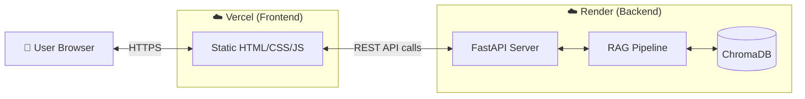
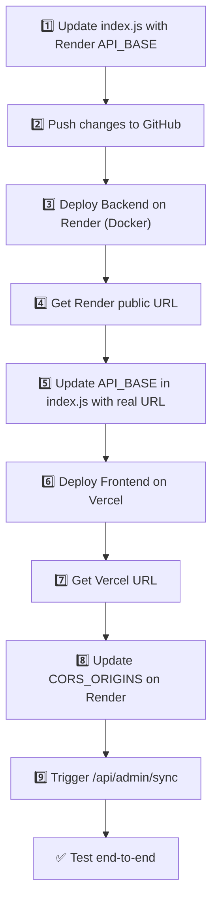

# Deployment Plan — Vercel (Frontend) + Render (Backend)

> **Last Updated: 12-Jun-2026**

This document provides a step-by-step guide to deploy the Mutual Fund FAQ Assistant with the **frontend on Vercel** (free tier) and the **backend on Render** (free tier).

---

## Architecture After Deployment



---

## Why Render Over Railway?

| Factor | Render (Free) | Railway |
|---|---|---|
| **Free Credits** | **100% Free** forever | $5/month (trial plan only) |
| **Playwright** | ✅ Works directly with Dockerfile | ✅ Works with Docker/Nixpacks |
| **RAM** | 512 MB | 8 GB (trial) |
| **Cold Starts** | Spins down after 15 min | Always warm |
| **Disk Persistence** | ⚠️ Lost on re-deploys (free) | Persistent volumes |

> [!WARNING]
> **Ephemeral Storage on Render Free Tier**
> Render's Free Tier does not have persistent disks. When the instance sleeps after 15 minutes of inactivity, your ChromaDB `chroma_data` folder will be wiped. You will need to click **"Sync Knowledge Base"** in the frontend to re-scrape the data whenever the server wakes up.

The `BAAI/bge-small-en-v1.5` embedding model requires ~130 MB RAM. Render's 512 MB free tier handles this perfectly.

---

## Prerequisites

Before starting, ensure you have:

- [x] GitHub repository pushed: `yv12/HDFC-Mutual-Fund-FAQ--Groww`
- [ ] A [Vercel](https://vercel.com) account (free — sign up with GitHub)
- [ ] A [Render](https://render.com) account (sign up with GitHub)
- [ ] Your Groq API key ready (`gsk_...`)

---

## Part 1 — Deploy Backend on Render

Render must be deployed **first** because we need its live URL to configure the frontend.

### Step 1.1 — Create a Render.yaml Blueprint (Optional but Recommended)

You can deploy directly using the Render dashboard, but having a `backend/render.yaml` Blueprint makes it a 1-click deployment. This file configures the Docker environment automatically.

### Step 1.2 — Create a Render Web Service

1. Go to [https://dashboard.render.com](https://dashboard.render.com)
2. Click **"New"** → **"Web Service"**
3. Select **"Build and deploy from a Git repository"**
4. Connect your GitHub account and select your repository: `yv12/HDFC-Mutual-Fund-FAQ--Groww`

### Step 1.3 — Configure Service Settings

Configure the service with the following settings:

| Setting | Value |
|---|---|
| **Name** | `hdfc-faq-backend` |
| **Region** | Singapore (or closest to you) |
| **Branch** | `main` |
| **Root Directory** | `backend` |
| **Environment** | `Docker` |
| **Instance Type** | Free ($0/month) |

> [!NOTE]
> Render will automatically detect the `Dockerfile` in the `backend` folder and use it to build the environment, including installing Playwright.

### Step 1.4 — Set Environment Variables on Render

Scroll down to **Advanced** and add the following Environment Variables:

| Key | Value |
|---|---|
| `XAI_API_KEY` | `<your-groq-api-key-here>` |
| `XAI_BASE_URL` | `https://api.groq.com/openai/v1` |
| `LLM_MODEL` | `llama-3.1-8b-instant` |
| `EMBEDDING_MODEL` | `BAAI/bge-small-en-v1.5` |
| `EMBEDDING_DIMENSIONS` | `384` |
| `EMBEDDING_DEVICE` | `cpu` |
| `CHROMA_PERSIST_DIR` | `./chroma_data` |
| `CHROMA_COLLECTION_NAME` | `mutual_fund_faq` |
| `RETRIEVAL_TOP_K` | `4` |
| `SIMILARITY_THRESHOLD` | `0.35` |
| `CHUNK_SIZE` | `250` |
| `CHUNK_OVERLAP` | `30` |
| `API_HOST` | `0.0.0.0` |
| `CORS_ORIGINS` | `https://hdfc-faq.vercel.app,http://localhost:3000,http://127.0.0.1:5500` |
| `RATE_LIMIT_PER_MINUTE` | `20` |
| `SCRAPE_TIMEOUT_MS` | `30000` |
| `SCRAPE_MAX_RETRIES` | `3` |

> [!CAUTION]
> Replace the `XAI_API_KEY` above with your actual key. Never commit API keys to GitHub.

Click **"Create Web Service"**.

### Step 1.5 — Generate a Public URL

Render will immediately start building your Docker image. Once deployed, Render will give you a public URL like:
```
https://hdfc-faq-backend.onrender.com
```

Save this URL — you need it for the frontend.

### Step 1.6 — Verify Backend is Running

Visit your Render URL in a browser:

```
https://hdfc-faq-backend.onrender.com/health
```

You should see:
```json
{
  "status": "healthy",
  "service": "Mutual Fund FAQ Assistant",
  "version": "0.1.0"
}
```

### Step 1.7 — Trigger Initial Data Ingestion

```bash
curl -X POST https://hdfc-faq-backend.onrender.com/api/admin/sync
```

This will scrape the 5 Groww URLs and populate the ChromaDB vector store. *(Remember, on the Free Tier, you must trigger this whenever the server wakes from sleep).*

---

## Part 2 — Deploy Frontend on Vercel

### Step 2.1 — Code Change Required: API Base URL

> [!IMPORTANT]
> The frontend currently uses relative API paths (`/api/chat`), which only work when frontend and backend are on the same server. For a split deployment, the frontend must point to the Render backend URL.

Update `frontend/index.js` — change `API_BASE` to your new Render URL:

```javascript
// API base URL — points to Render backend
const API_BASE = 'https://hdfc-faq-backend.onrender.com';
```

### Step 2.2 — Create a Vercel Project

1. Go to [https://vercel.com/new](https://vercel.com/new)
2. Click **"Import Git Repository"**
3. Select your GitHub repo: `yv12/HDFC-Mutual-Fund-FAQ--Groww`
4. Configure the project:

| Setting | Value |
|---|---|
| **Project Name** | `hdfc-faq` |
| **Framework Preset** | Other |
| **Root Directory** | `frontend` |
| **Build Command** | *(leave empty — no build step needed)* |
| **Output Directory** | `.` |
| **Install Command** | *(leave empty)* |

5. Click **"Deploy"**

### Step 2.3 — Note Your Frontend URL

After deployment, Vercel will give you a URL like:
```
https://hdfc-faq.vercel.app
```

### Step 2.4 — Update CORS on Render

Now go back to your Render dashboard, select your Web Service → **Environment**, and update the `CORS_ORIGINS` variable to include your actual Vercel URL:

```
CORS_ORIGINS=https://hdfc-faq.vercel.app
```

Render will auto-redeploy after the variable change.

---

## Part 3 — Post-Deployment Verification

### Checklist

| # | Check | How to Verify |
|---|---|---|
| 1 | Backend health | Visit `https://<render-url>/health` → expect `200 OK` |
| 2 | Frontend loads | Visit `https://hdfc-faq.vercel.app` → chat UI appears |
| 3 | Chat works | Ask: *"What is the expense ratio of HDFC Mid Cap Fund?"* |
| 4 | CORS works | No `Access-Control-Allow-Origin` errors in browser console |
| 5 | Sync works | Click "Sync Knowledge Base" → status shows ✅ |
| 6 | Query Rewriter works | Ask: *"What is the NAV of the HDFC Opportunities Fund?"* |
| 7 | Alias handling | Ask: *"Tell me about the Top 100 fund"* → returns Large Cap data |

### Troubleshooting

| Problem | Likely Cause | Fix |
|---|---|---|
| Frontend shows "Network error" | CORS not configured or backend sleeping | Verify `CORS_ORIGINS` on Render includes your Vercel URL, and wait 1 minute for backend to wake up |
| "I don't have this information" for all queries | Data wiped during sleep | Click the "Sync" button in the UI to re-scrape the data |
| Backend returns 502/503 | Service sleeping or starting | Wait 1–2 minutes for initial deployment or wake-up |

---

## Cost Summary

| Service | Tier | Cost |
|---|---|---|
| **Vercel** (Frontend) | Hobby (Free) | **$0/month** |
| **Render** (Backend) | Free Web Service | **$0/month** |
| **Groq** (LLM API) | Free tier | **$0/month** |
| **Total** | | **$0/month** |

---

## Deployment Order Summary


