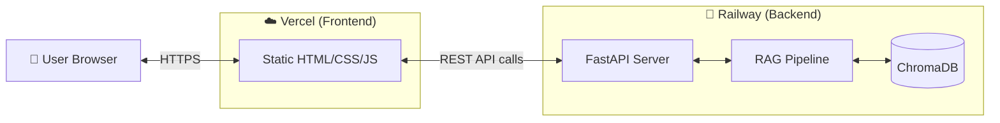
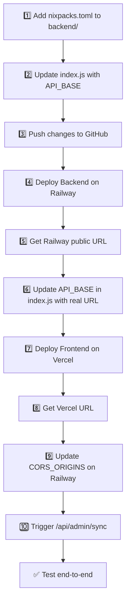

# Deployment Plan — Vercel (Frontend) + Railway (Backend)

> **Last Updated: 11-Jun-2026**

This document provides a step-by-step guide to deploy the Mutual Fund FAQ Assistant with the **frontend on Vercel** (free tier) and the **backend on Railway** (trial/$5 free credit per month).

---

## Architecture After Deployment



---

## Why Railway Over Render?

| Factor | Railway | Render (Free) |
|---|---|---|
| **RAM** | **8 GB** (trial) | 512 MB ❌ (too small for embedding model) |
| **Cold Starts** | **None** — always warm | Spins down after 15 min |
| **Free Credits** | **$5/month** (trial plan) | Free but crashes with our model |
| **Disk Persistence** | ✅ Persistent volumes | Lost on re-deploys (free) |
| **Deploy Speed** | ~30 seconds | ~2–5 minutes |
| **Playwright** | ✅ Works with Docker | ⚠️ Needs extra build commands |

The `BAAI/bge-large-en-v1.5` embedding model requires ~1.3 GB RAM. Railway's 8 GB trial tier handles this easily.

---

## Prerequisites

Before starting, ensure you have:

- [x] GitHub repository pushed: [yv12/HDFC-Mutual-Fund-FAQ--Groww](https://github.com/yv12/HDFC-Mutual-Fund-FAQ--Groww)
- [ ] A [Vercel](https://vercel.com) account (free — sign up with GitHub)
- [ ] A [Railway](https://railway.app) account (sign up with GitHub)
- [ ] Your Groq API key ready (`gsk_...`)

---

## Part 1 — Deploy Backend on Railway

Railway must be deployed **first** because we need its live URL to configure the frontend.

### Step 1.1 — Code Changes Required Before Deploying

> [!IMPORTANT]
> The frontend static mount in `app/main.py` is already safe. It checks `if _FRONTEND_DIR.is_dir()` before mounting, so on Railway where the `frontend/` folder won't exist at the expected path, the mount is simply skipped. **No code change needed.**

### Step 1.2 — Create a Railway Project

1. Go to [https://railway.app/new](https://railway.app/new)
2. Click **"Deploy from GitHub Repo"**
3. Select your repository: `yv12/HDFC-Mutual-Fund-FAQ--Groww`
4. Railway will auto-detect the project. Click **"Add Service"** → **"GitHub Repo"**

### Step 1.3 — Configure Service Settings

After the service is created, click on it and go to **Settings**:

| Setting | Value |
|---|---|
| **Root Directory** | `/backend` |
| **Builder** | Nixpacks (default — auto-detects Python) |
| **Start Command** | `uvicorn app.main:app --host 0.0.0.0 --port $PORT` |

> [!NOTE]
> Railway automatically detects `requirements.txt` and installs dependencies. No build command configuration needed.

### Step 1.4 — Install Playwright on Railway

Playwright needs a browser binary for web scraping. Add a `nixpacks.toml` file in your `backend/` directory:

```toml
# backend/nixpacks.toml

[phases.setup]
aptPkgs = [
    "libnss3",
    "libatk1.0-0",
    "libatk-bridge2.0-0",
    "libcups2",
    "libdrm2",
    "libxkbcommon0",
    "libxcomposite1",
    "libxdamage1",
    "libxrandr2",
    "libgbm1",
    "libpango-1.0-0",
    "libcairo2",
    "libasound2",
    "libxshmfence1"
]

[phases.install]
cmds = ["pip install -r requirements.txt", "playwright install chromium"]
```

### Step 1.5 — Set Environment Variables on Railway

In the Railway dashboard, click on your service → **Variables** tab → **Raw Editor** and paste:

```env
XAI_API_KEY=<your-groq-api-key-here>
XAI_BASE_URL=https://api.groq.com/openai/v1
LLM_MODEL=llama-3.1-8b-instant
EMBEDDING_MODEL=BAAI/bge-large-en-v1.5
EMBEDDING_DIMENSIONS=1024
EMBEDDING_DEVICE=cpu
CHROMA_PERSIST_DIR=./chroma_data
CHROMA_COLLECTION_NAME=mutual_fund_faq
RETRIEVAL_TOP_K=4
SIMILARITY_THRESHOLD=0.35
CHUNK_SIZE=250
CHUNK_OVERLAP=30
API_HOST=0.0.0.0
CORS_ORIGINS=https://hdfc-faq.vercel.app
RATE_LIMIT_PER_MINUTE=20
SCRAPE_TIMEOUT_MS=30000
SCRAPE_MAX_RETRIES=3
```

> [!CAUTION]
> Replace the `XAI_API_KEY` above with your actual key. Never commit API keys to GitHub.

> [!TIP]
> Railway automatically provides a `PORT` variable — do NOT set it manually. Your start command already uses `$PORT`.

### Step 1.6 — Generate a Public URL

By default, Railway services don't have a public URL. To expose yours:

1. Click on your service → **Settings** → **Networking**
2. Click **"Generate Domain"**
3. Railway will give you a URL like:
   ```
   https://hdfc-faq-backend-production.up.railway.app
   ```

Save this URL — you need it for the frontend.

### Step 1.7 — Verify Backend is Running

Visit your Railway URL in a browser:

```
https://hdfc-faq-backend-production.up.railway.app/health
```

You should see:
```json
{
  "status": "healthy",
  "service": "Mutual Fund FAQ Assistant",
  "version": "0.1.0"
}
```

### Step 1.8 — Trigger Initial Data Ingestion

```bash
curl -X POST https://hdfc-faq-backend-production.up.railway.app/api/admin/sync
```

This will scrape the 5 Groww URLs and populate the ChromaDB vector store.

---

## Part 2 — Deploy Frontend on Vercel

### Step 2.1 — Code Change Required: API Base URL

> [!IMPORTANT]
> The frontend currently uses relative API paths (`/api/chat`), which only work when frontend and backend are on the same server. For a split deployment, the frontend must point to the Railway backend URL.

Update `frontend/index.js` — add this at the very top of the file:

```javascript
// API base URL — empty for local dev, Railway URL for production
const API_BASE = window.location.hostname === 'localhost'
    ? ''
    : 'https://hdfc-faq-backend-production.up.railway.app';
```

Then update all three `fetch` calls:

```diff
  // Line ~152: Chat submit
- const response = await fetch('/api/chat', {
+ const response = await fetch(`${API_BASE}/api/chat`, {

  // Line ~224: Sync trigger
- const response = await fetch('/api/admin/sync', {
+ const response = await fetch(`${API_BASE}/api/admin/sync`, {

  // Line ~235: Sync status poll
- const statusRes = await fetch('/api/admin/sync/status');
+ const statusRes = await fetch(`${API_BASE}/api/admin/sync/status`);
```

### Step 2.2 — Create a Vercel Project

1. Go to [https://vercel.com/new](https://vercel.com/new)
2. Click **"Import Git Repository"**
3. Select your GitHub repo: `yv12/HDFC-Mutual-Fund-FAQ--Groww`
4. Configure the project:

| Setting | Value |
|---|---|
| **Project Name** | `hdfc-faq` |
| **Framework Preset** | Other |
| **Root Directory** | `frontend` |
| **Build Command** | *(leave empty — no build step needed)* |
| **Output Directory** | `.` |
| **Install Command** | *(leave empty)* |

5. Click **"Deploy"**

### Step 2.3 — Note Your Frontend URL

After deployment, Vercel will give you a URL like:
```
https://hdfc-faq.vercel.app
```

### Step 2.4 — Update CORS on Railway

Now go back to your Railway dashboard and update the `CORS_ORIGINS` variable to include your actual Vercel URL:

```
CORS_ORIGINS=https://hdfc-faq.vercel.app,https://hdfc-faq-yv12.vercel.app
```

Railway will auto-redeploy after the variable change.

---

## Part 3 — Post-Deployment Verification

### Checklist

| # | Check | How to Verify |
|---|---|---|
| 1 | Backend health | Visit `https://<railway-url>/health` → expect `200 OK` |
| 2 | Frontend loads | Visit `https://hdfc-faq.vercel.app` → chat UI appears |
| 3 | Chat works | Ask: *"What is the expense ratio of HDFC Mid Cap Fund?"* |
| 4 | CORS works | No `Access-Control-Allow-Origin` errors in browser console |
| 5 | Sync works | Click "Sync Knowledge Base" → status shows ✅ |
| 6 | Query Rewriter works | Ask: *"What is the NAV of the HDFC Opportunities Fund?"* |
| 7 | Alias handling | Ask: *"Tell me about the Top 100 fund"* → returns Large Cap data |

### Troubleshooting

| Problem | Likely Cause | Fix |
|---|---|---|
| Frontend shows "Network error" | CORS not configured or backend still deploying | Verify `CORS_ORIGINS` on Railway includes your Vercel URL |
| Backend crashes on startup | Missing Playwright dependencies | Add `nixpacks.toml` with apt packages (see Step 1.4) |
| "I don't have this information" for all queries | Data not ingested yet | Trigger `/api/admin/sync` to run the ingestion pipeline |
| Backend returns 502/503 | Service still starting up | Wait 1–2 minutes for initial deployment |
| Embedding model download hangs | Slow network on Railway | First deploy takes longer; subsequent deploys use cached model |

---

## Cost Summary

| Service | Tier | Cost |
|---|---|---|
| **Vercel** (Frontend) | Hobby (Free) | **$0/month** |
| **Railway** (Backend) | Trial Plan | **$5 free credit/month** |
| **Groq** (LLM API) | Free tier | **$0/month** |
| **Total** | | **$0/month** (within free credits) |

> [!NOTE]
> Railway's trial plan gives $5 of free credit per month. A lightweight FastAPI app like this typically uses $1–3/month, so you should stay well within the free credits. If you exceed $5, Railway will pause the service until next month's credits refresh.

---

## Deployment Order Summary



---

## Future Improvements

- [ ] Add a custom domain (e.g., `faq.yourdomain.com`) on Vercel
- [ ] Set up Railway auto-deploy on `git push` (enabled by default)
- [ ] Add a Railway persistent volume for ChromaDB data to survive re-deploys
- [ ] Consider migrating to a managed vector database (e.g., Pinecone free tier) for better persistence
- [ ] Add monitoring/alerting via Railway's built-in metrics dashboard
