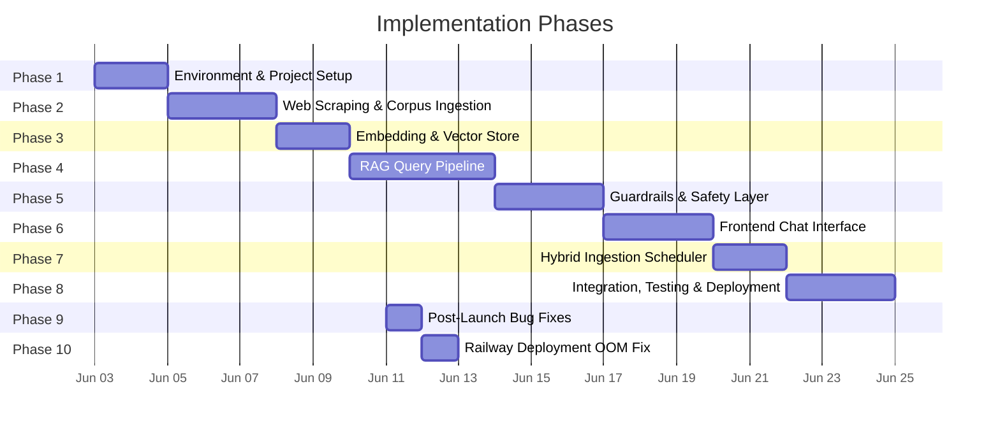

# Implementation Plan — Mutual Fund FAQ Assistant

> **Last Updated: 12-Jun-2026** — Embedding model downsize for Railway deployment (Phase 10 added).
> Switched from `BAAI/bge-large-en-v1.5` (1024d, ~1.3GB) to `BAAI/bge-small-en-v1.5` (384d, ~130MB)
> to resolve OOM (Out of Memory) kills on Railway.
> See previous update: [Fix.txt](file:///d:/RAG%20Chatbot/Docs/Fix.txt) for 11-Jun-2026 bug-fix details.

## Executive Summary

A phased implementation plan to build the RAG-based Mutual Fund FAQ Assistant end-to-end. The plan covers **8 delivery phases + 1 post-launch bug-fix phase (Phase 9) + 1 deployment fix phase (Phase 10)**, progressing from environment setup through deployment and real-world Q&A validation.



---

## Phase 1 — Environment & Project Setup

**Goal**: Establish the project structure, dependencies, and configuration foundation.

### Tasks

| # | Task | Details |
|---|---|---|
| 1.1 | Initialize project repository | Create folder structure, `.gitignore`, `README.md` |
| 1.2 | Set up Python virtual environment | `python -m venv venv` or `conda create` |
| 1.3 | Install core dependencies | FastAPI, Uvicorn, ChromaDB, LangChain, BeautifulSoup/Playwright, OpenAI SDK (for Ollama compatibility), sentence-transformers |
| 1.4 | Create `requirements.txt` / `pyproject.toml` | Pin all dependency versions for reproducibility |
| 1.5 | Set up environment variables | Ollama Endpoint URL, model names, vector store paths, embedding device |
| 1.6 | Create configuration module | Centralized config file (`config.py` or `.env`) for all tunable parameters |
| 1.7 | Define project folder structure | See structure below |

### Proposed Folder Structure

```
RAG Chatbot/
├── Docs/
│   ├── problemStatement.md
│   ├── context.md
│   ├── architecture.md
│   └── implementation-plan.md
├── backend/
│   ├── app/
│   │   ├── __init__.py
│   │   ├── main.py                 # FastAPI entry point
│   │   ├── config.py               # Environment & configuration
│   │   ├── scraper/
│   │   │   ├── __init__.py
│   │   │   ├── scraper.py          # Web scraping logic
│   │   │   └── urls.py             # Pre-approved URL list
│   │   ├── ingestion/
│   │   │   ├── __init__.py
│   │   │   ├── chunker.py          # Document chunking
│   │   │   ├── embedder.py         # Embedding generation
│   │   │   └── vector_store.py     # ChromaDB operations
│   │   ├── pipeline/
│   │   │   ├── __init__.py
│   │   │   ├── query_classifier.py # Factual vs. advisory detection
│   │   │   ├── query_rewriter.py   # LLM alias normalization
│   │   │   ├── retriever.py        # Vector similarity search
│   │   │   ├── generator.py        # LLM prompt + generation
│   │   │   ├── citation_validator.py # Zero-hallucination URL check
│   │   │   └── refusal_handler.py  # Polite refusal responses
│   │   ├── security/
│   │   │   ├── __init__.py
│   │   │   └── pii_scanner.py      # PII detection & blocking
│   │   └── api/
│   │       ├── __init__.py
│   │       └── routes.py           # API endpoints
│   ├── scripts/
│   │   └── ingest.py               # One-time ingestion script
│   ├── tests/
│   │   ├── test_scraper.py
│   │   ├── test_chunker.py
│   │   ├── test_classifier.py
│   │   ├── test_citation.py
│   │   ├── test_pii.py
│   │   └── test_pipeline.py
│   ├── requirements.txt
│   └── .env
├── frontend/
│   ├── index.html
│   ├── index.css
│   └── index.js
└── .gitignore
```

### Acceptance Criteria

- [x] Project runs with `uvicorn app.main:app` without errors
- [x] All dependencies install cleanly from `requirements.txt`
- [x] Config module loads environment variables correctly
- [x] Health-check endpoint (`GET /health`) returns `200 OK`

---

## Phase 2 — Web Scraping & Corpus Ingestion

**Goal**: Scrape the 5 Groww URLs, extract structured mutual fund data, and prepare clean text for embedding.

### Tasks

| # | Task | Details |
|---|---|---|
| 2.1 | Build web scraper module | Fetch HTML from each of the 5 pre-approved Groww URLs |
| 2.2 | Handle dynamic rendering | Groww uses client-side rendering; use Playwright or Selenium for JS-heavy pages |
| 2.3 | Build content extractor | Parse HTML → extract structured fields (expense ratio, exit load, SIP amount, fund manager, AUM, benchmark, riskometer, etc.) |
| 2.4 | Preserve source metadata | Attach `source_url`, `scheme_name`, `section`, `scraped_at` to every extracted block |
| 2.5 | Build document chunker | Split extracted text into chunks of ~200–300 tokens (semantic section isolation ensures no splitting for sections under 130 tokens) with ~30-token overlap |
| 2.6 | Validate chunk quality | Manually inspect a sample of chunks to verify completeness and metadata accuracy |
| 2.7 | Create ingestion script | `scripts/ingest.py` — orchestrates scrape → extract → chunk → store |
| 2.8 | Add error handling & retries | Network timeouts, rate limiting, partial page loads |

### Source URLs

| # | Scheme | URL |
|---|---|---|
| 1 | HDFC Mid Cap Fund – Direct Growth | `https://groww.in/mutual-funds/hdfc-mid-cap-fund-direct-growth` |
| 2 | HDFC Large Cap Fund – Direct Growth | `https://groww.in/mutual-funds/hdfc-large-cap-fund-direct-growth` |
| 3 | HDFC Small Cap Fund – Direct Growth | `https://groww.in/mutual-funds/hdfc-small-cap-fund-direct-growth` |
| 4 | HDFC Gold ETF Fund of Fund – Direct Growth | `https://groww.in/mutual-funds/hdfc-gold-etf-fund-of-fund-direct-plan-growth` |
| 5 | HDFC Defence Fund – Direct Growth | `https://groww.in/mutual-funds/hdfc-defence-fund-direct-growth` |

### Chunk Metadata Schema

```json
{
  "chunk_id": "hdfc-midcap-003",
  "text": "The expense ratio of HDFC Mid Cap Fund Direct Growth is 0.74%...",
  "source_url": "https://groww.in/mutual-funds/hdfc-mid-cap-fund-direct-growth",
  "scheme_name": "HDFC Mid Cap Fund – Direct Growth",
  "section": "Fund Details",
  "scraped_at": "2026-06-02T00:00:00Z"
}
```

### Acceptance Criteria

- [x] All 5 URLs are scraped successfully with full content extraction
- [x] Each chunk carries complete metadata (`source_url`, `scheme_name`, `section`, `scraped_at`)
- [x] Chunks are between 200–300 tokens with proper overlap
- [x] Ingestion script is idempotent (re-running doesn't create duplicates)
- [x] Key data points extracted: expense ratio, exit load, min SIP, fund manager, AUM, benchmark, riskometer, lock-in period

---

## Phase 3 — Embedding & Vector Store

**Goal**: Convert text chunks into vector embeddings and index them in ChromaDB for fast retrieval.

### Tasks

| # | Task | Details |
|---|---|---|
| 3.1 | Select embedding model | **`BAAI/bge-small-en-v1.5`** via sentence-transformers — 384-dim, local, open-source, zero API cost. *Originally `bge-large-en-v1.5` (1024-dim); downsized on 12-Jun-2026 due to Railway OOM kills — see Phase 10.* |
| 3.2 | Build embedding module | `embedder.py` — batch-embed all chunks, handle API rate limits |
| 3.3 | Set up ChromaDB | Initialize a persistent ChromaDB collection with metadata schema |
| 3.4 | Build vector store module | `vector_store.py` — CRUD operations: add, query, delete, reset |
| 3.5 | Index all chunks | Store embeddings + metadata in ChromaDB |
| 3.6 | Validate retrieval quality | Run sample queries and verify that top-k results are semantically relevant |
| 3.7 | Tune retrieval parameters | Experiment with `k` value (3–5), similarity threshold, and chunk overlap |

### Key Decisions

| Decision | Choice | Rationale |
|---|---|---|
| Vector store | ChromaDB | Lightweight, embedded, no external infra needed |
| Embedding model | `BAAI/bge-small-en-v1.5` (local) | Lightweight 384-dim embeddings; runs locally via sentence-transformers with zero API cost. *Downsized from `bge-large` (1024d, ~1.3GB) on 12-Jun-2026 to fit Railway's memory limits (~130MB vs ~1.3GB).* |
| Similarity metric | Cosine similarity | Standard for text embeddings |
| Top-k | 4 | Covers the hardest multi-section questions while avoiding cross-fund noise |
| Similarity threshold | **0.35** *(lowered from 0.5 on 11-Jun-2026)* | BGE model returns 0.35–0.65 for relevant results; 0.5 was discarding valid chunks |

### Acceptance Criteria

- [x] All chunks are embedded and stored in ChromaDB
- [x] Sample queries return semantically relevant top-k chunks
- [x] Metadata is preserved and queryable in the vector store
- [x] Retrieval latency < 500ms for single query
- [x] Vector store persists across server restarts

---

## Phase 4 — RAG Query Pipeline

**Goal**: Build the core query-processing pipeline — from user input to validated, cited response.

### Tasks

| # | Task | Details |
|---|---|---|
| 4.1 | Build query classifier | Detect factual vs. advisory/out-of-scope queries |
| 4.2 | Build retriever module | Embed user query → cosine similarity search → return top-k chunks |
| 4.3 | Build context builder | Format retrieved chunks + metadata into a structured prompt context |
| 4.4 | Design system prompt | Strict facts-only prompt with all constraints (≤ 3 sentences, one citation, footer, no advice) |
| 4.5 | Build LLM generator module | Send prompt to local open-source model (e.g. `llama3` or `qwen2.5` via Ollama) using OpenAI-compatible client, parse response |
| 4.6 | Build citation validator | Post-process LLM output to enforce zero-hallucination URL policy |
| 4.7 | Build refusal handler | Generate polite refusal + educational link for advisory queries |
| 4.8 | Build response formatter | Assemble final response: answer + citation + footer |
| 4.9 | Create `/chat` API endpoint | `POST /chat` — accepts user query, returns formatted response |
| 4.10 | End-to-end pipeline integration | Wire all components together: classifier → retriever → generator → validator |

### System Prompt Design

```
You are a facts-only mutual fund FAQ assistant. You MUST follow these rules strictly:

1. Answer ONLY using the provided context. Do NOT use any external knowledge.
2. Keep responses to a MAXIMUM of 3 sentences.
3. Do NOT provide investment advice, opinions, or recommendations.
4. Do NOT generate, infer, or construct any URLs. Use ONLY URLs provided in the context.
5. If the context does not contain enough information, say "I don't have this information in my current sources."
6. End every response with: "Last updated from sources: <date>"
7. Be concise, factual, and professional.
```

### Query Classification Strategy

> [!NOTE]
> Updated 11-Jun-2026: Advisory keywords were refined to use specific phrases instead of single words.
> Single words like `best`, `better`, `invest`, `buy` were causing valid factual questions to be refused.
> See [Fix.txt](file:///d:/RAG%20Chatbot/Docs/Fix.txt) — Fix 1 for full explanation.

| Classification | Trigger Keywords / Patterns | Action |
|---|---|---|
| **Factual** | expense ratio, exit load, SIP, lumpsum, minimum investment, lock-in, benchmark, index, track, fund manager, AUM, NAV, riskometer, risk level, rating, stamp duty, about, tell me, how long, withdraw, allocation, portfolio, scheme, factsheet | → RAG pipeline |
| **Advisory** | should i invest, should i buy, which is better, which is best, best fund, better option, investment advice, suggest, compare, comparison, advisable, good choice, advise me, would you choose, performance comparison, sip calculator, returns calculator | → Refusal handler |
| **Out-of-Scope** | No keyword match from either list | → Polite redirect |
| **PII-containing** | PAN, Aadhaar, account number patterns | → Block + warning |

### Citation Validation Logic

```
1. Parse LLM response for any URLs
2. For each URL found:
   a. Check if URL exists verbatim in retrieved chunk metadata
   b. If YES → keep URL
   c. If NO → strip URL, replace with text-only citation (scheme name + section)
3. If no URL in response:
   a. Attach source_url from the top-ranked retrieved chunk
4. Append footer: "Last updated from sources: <scraped_at date>"
```

### Acceptance Criteria

- [x] Factual queries return accurate, ≤ 3-sentence answers with correct citations
- [x] Advisory queries are correctly classified and refused
- [x] Citation validator strips all hallucinated URLs
- [x] Every response includes exactly one citation (URL or text-only fallback)
- [x] Every response includes the "Last updated from sources" footer
- [x] `/chat` endpoint responds in < 3 seconds
- [x] System prompt effectively constrains LLM behavior

---

## Phase 5 — Guardrails & Safety Layer

**Goal**: Implement all security, privacy, and compliance guardrails.

### Tasks

| # | Task | Details |
|---|---|---|
| 5.1 | Build PII scanner | Regex-based detection for PAN, Aadhaar, email, phone, OTP, account numbers |
| 5.2 | Integrate PII scanner into pipeline | Block queries containing PII before they reach the RAG pipeline |
| 5.3 | Design PII warning response | *"For your safety, I cannot process personal information such as PAN, Aadhaar, or account numbers."* |
| 5.4 | Harden query classifier | Add edge cases: mixed advisory+factual queries, subtle opinion-seeking |
| 5.5 | Add input sanitization | Strip potential prompt injection attempts, limit query length |
| 5.6 | Enforce session-only chat | No persistence of user queries or chat history beyond the session |
| 5.7 | Add rate limiting | Prevent abuse via excessive API calls |
| 5.8 | Content boundary testing | Verify system refuses performance comparisons, return calculations |

### PII Detection Patterns

| PII Type | Regex Pattern | Example |
|---|---|---|
| PAN | `[A-Z]{5}[0-9]{4}[A-Z]{1}` | ABCDE1234F |
| Aadhaar | `[0-9]{4}\s?[0-9]{4}\s?[0-9]{4}` | 1234 5678 9012 |
| Phone (India) | `(\+91[\-\s]?)?[6-9]\d{9}` | +91 9876543210 |
| Email | `[a-zA-Z0-9._%+-]+@[a-zA-Z0-9.-]+\.[a-zA-Z]{2,}` | user@example.com |
| OTP | `\b\d{4,6}\b` (in context of "OTP") | 123456 |

### Acceptance Criteria

- [x] PII scanner detects and blocks PAN, Aadhaar, phone, email, OTP patterns
- [x] PII-containing queries never reach the LLM or vector store
- [x] Mixed advisory+factual queries are classified as advisory (conservative approach)
- [x] Prompt injection attempts are sanitized
- [x] No user data persists beyond the browser session
- [x] Rate limiting is active (e.g., 20 requests/minute per session)
- [x] System refuses performance comparisons, return calculations with appropriate messages

---

## Phase 6 — Frontend Chat Interface

**Goal**: Build a minimal, polished chat UI that connects to the backend API.

### Tasks

| # | Task | Details |
|---|---|---|
| 6.1 | Create HTML structure | Header, disclaimer banner, chat window, input box, example questions |
| 6.2 | Design CSS styles | Clean, modern design; dark/light mode; responsive layout |
| 6.3 | Implement welcome screen | Welcome message + 3 clickable example questions |
| 6.4 | Build chat message rendering | User/assistant message bubbles with proper styling |
| 6.5 | Implement API integration | `POST /chat` calls from frontend JS |
| 6.6 | Add loading/typing indicator | Visual feedback while waiting for backend response |
| 6.7 | Render citations & footer | Display source link and "Last updated" footer in assistant messages |
| 6.8 | Add persistent disclaimer | *"Facts-only. No investment advice."* — always visible |
| 6.9 | Handle error states | Network errors, timeout, server errors — show user-friendly messages |
| 6.10 | Mobile responsiveness | Ensure chat UI works on mobile viewports |
| 6.11 | Add manual sync button | "Sync Knowledge Base" button with loading state to trigger ingestion API |

### UI Components

| Component | Specification |
|---|---|
| **Header** | App title + HDFC Mutual Fund badge + disclaimer |
| **Disclaimer Banner** | Persistent yellow/amber bar: *"Facts-only. No investment advice."* |
| **Welcome Message** | *"Welcome! I can answer factual questions about HDFC Mutual Fund schemes."* |
| **Example Questions** | 3 clickable cards: expense ratio, fund manager, exit load |
| **Chat Window** | Scrollable, auto-scroll to latest message |
| **User Bubble** | Right-aligned, distinct color |
| **Assistant Bubble** | Left-aligned, includes citation link + footer |
| **Input Box** | Text field + send button (Enter key support) |
| **Loading Indicator** | Animated dots or spinner while awaiting response |
| **Admin Controls** | "Sync Knowledge Base" button for manual data ingestion trigger |

### Example Questions (Clickable)

1. *"What is the expense ratio of HDFC Mid Cap Fund?"*
2. *"Who is the fund manager of HDFC Small Cap Fund?"*
3. *"What is the exit load for HDFC Large Cap Fund?"*

### Acceptance Criteria

- [ ] Chat UI loads with welcome message and 3 example questions
- [ ] Clicking an example question sends it as a query
- [ ] User and assistant messages render correctly with distinct styles
- [ ] Citation links are clickable and open in a new tab
- [ ] "Last updated" footer appears on every assistant message
- [ ] Disclaimer banner is always visible
- [ ] Loading indicator shows during API calls
- [ ] Error states are handled gracefully
- [ ] UI is responsive on mobile
- [ ] "Sync Knowledge Base" button is visible and can trigger loading state

---

## Phase 7 — Hybrid Ingestion Scheduler

**Goal**: Implement an automated daily schedule (9:15 AM) and a manual API endpoint for on-demand knowledge base synchronization.

### Tasks

| # | Task | Details |
|---|---|---|
| 7.1 | Install scheduler | Add `apscheduler` to dependencies |
| 7.2 | Build scheduler module | `scheduler.py` — configure `BackgroundScheduler` |
| 7.3 | Create cron job | Schedule the ingestion pipeline to run daily at 9:15 AM |
| 7.4 | Create manual sync API | `POST /api/admin/sync` — triggers ingestion asynchronously |
| 7.5 | Integrate with FastAPI lifespan | Start/stop `BackgroundScheduler` cleanly during app startup/shutdown |
| 7.6 | Test sync API | Unit test to verify the `/api/admin/sync` endpoint triggers the process |

### Acceptance Criteria

- [ ] `apscheduler` is installed and running inside the FastAPI process.
- [ ] `POST /api/admin/sync` successfully triggers the ingestion pipeline and returns a 202 Accepted response.
- [ ] A cron job is configured to run at 9:15 AM local time daily.

---

## Phase 8 — Integration, Testing & Deployment

**Goal**: End-to-end testing, edge case coverage, and deployment.

### Tasks

| # | Task | Details |
|---|---|---|
| 8.1 | End-to-end integration testing | Full flow: UI → API → classifier → retriever → LLM → validator → UI |
| 8.2 | Build test suite | Unit tests for each module + integration tests for the pipeline |
| 8.3 | Edge case testing | See test matrix below |
| 8.4 | Performance testing | Measure response latency, concurrent user handling |
| 8.5 | Create README | Setup instructions, architecture overview, known limitations |
| 8.6 | Add disclaimer snippet | Prominent in README and UI |
| 8.7 | Deploy application | Local deployment or cloud (see deployment options) |
| 8.8 | Final review & documentation | Code cleanup, docstrings, inline comments |

### Test Matrix

| Test Category | Test Cases | Expected Result |
|---|---|---|
| **Factual — Expense Ratio** | "What is the expense ratio of HDFC Mid Cap Fund?" | Correct ratio + Groww URL + footer |
| **Factual — Fund Manager** | "Who manages HDFC Small Cap Fund?" | Fund manager name + source |
| **Factual — Exit Load** | "What is the exit load for HDFC Large Cap Fund?" | Exit load details + source |
| **Factual — AUM** | "What is the AUM of HDFC Defence Fund?" | AUM figure + source |
| **Factual — Benchmark** | "What benchmark does HDFC Gold ETF FoF track?" | Benchmark index + source |
| **Factual — SIP Minimum** | "What is the minimum SIP for HDFC Mid Cap?" | Min SIP amount + source |
| **Factual — Riskometer** | "What is the risk level of HDFC Small Cap Fund?" | Riskometer category + source |
| **Advisory — Invest** | "Should I invest in HDFC Mid Cap Fund?" | Polite refusal + AMFI/SEBI link |
| **Advisory — Comparison** | "Is Mid Cap better than Large Cap?" | Polite refusal |
| **Advisory — Returns** | "What returns will I get from HDFC Small Cap?" | Refusal + factsheet link |
| **PII — PAN** | "My PAN is ABCDE1234F, check my fund" | PII block warning |
| **PII — Aadhaar** | "Aadhaar 1234 5678 9012" | PII block warning |
| **PII — Phone** | "Call me at 9876543210" | PII block warning |
| **Out-of-Scope** | "What is the weather today?" | Polite redirect |
| **Hallucination — URL** | Verify no response contains a URL not in chunk metadata | All URLs match source metadata |
| **Empty Query** | "" (empty string) | Prompt user to ask a question |
| **Long Query** | 500+ character query | Handled gracefully (truncated or processed) |
| **Mixed Query** | "What is the expense ratio and should I invest?" | Conservative: treated as advisory → refusal |

### Deployment Options

| Option | Stack | Best For |
|---|---|---|
| **Local** | `uvicorn` + ChromaDB on disk | Development, demo |
| **Docker** | Containerized backend + frontend | Portable, reproducible |
| **Cloud** | AWS/GCP/Azure VM or serverless | Production-grade |

### README Outline

```
# Mutual Fund FAQ Assistant

## Overview
## Selected AMC & Schemes
## Architecture (RAG Approach)
## Setup Instructions
  - Prerequisites
  - Installation
  - Environment Variables
  - Running the Ingestion Script
  - Starting the Server
## Usage
## Disclaimer
  "Facts-only. No investment advice."
## Known Limitations
## License
```

### Acceptance Criteria

- [ ] All test cases in the test matrix pass
- [ ] End-to-end flow works: query → response in < 3 seconds
- [ ] No hallucinated URLs in any test response
- [ ] All refusal cases handled correctly
- [ ] PII scanner blocks all PII patterns
- [ ] README is complete with setup instructions
- [ ] Application starts and runs without errors
- [ ] Code is clean, documented, and version-controlled

---

## Phase 9 — Post-Launch Bug Fixes (11-Jun-2026)

**Goal**: Diagnose and fix pipeline bugs discovered during real-world Q&A testing that caused the bot to incorrectly say *"I don't have this information"* for valid questions.

> See [Fix.txt](file:///d:/RAG%20Chatbot/Docs/Fix.txt) for the complete before/after log of all changes.

### What Triggered This Phase

Six factual questions were tested against the live bot. Four failed — not because data was missing, but because bugs in the classifier, retriever, and configuration were silently blocking valid answers.

### Tasks Completed

| # | Task | File Changed | Status |
|---|---|---|---|
| 9.1 | Removed overly broad advisory keywords (`best`, `better`, `invest`, `buy`, `sell`, `which fund`) | `pipeline/query_classifier.py` | ✅ Done |
| 9.2 | Replaced with specific multi-word advisory phrases (`should i invest`, `which is best`, `best fund`) | `pipeline/query_classifier.py` | ✅ Done |
| 9.3 | Added 14 new factual keywords (`tell me`, `how long`, `withdraw`, `allocation`, `portfolio`, etc.) | `pipeline/query_classifier.py` | ✅ Done |
| 9.4 | Added Groww display-name aliases to scheme routing map (`top 100` → Large Cap, `opportunities` → Mid Cap) | `pipeline/retriever.py` | ✅ Done |
| 9.5 | Removed risky single-word routing keys (`mid`, `large`, `small`, `etf`); replaced with safer two-word phrases | `pipeline/retriever.py` | ✅ Done |
| 9.6 | Lowered similarity threshold from 0.5 → 0.35 | `config.py` | ✅ Done |
| 9.7 | Softened LLM Rule 5 to allow simple logical inference from context | `pipeline/generator.py` | ✅ Done |
| 9.8 | Updated LLM Rule 7 with explicit alias knowledge (`Top 100` = Large Cap, `Opportunities` = Mid Cap) | `pipeline/generator.py` | ✅ Done |

### Known Remaining Limitation

> [!WARNING]
> **Asset allocation / portfolio breakdown data (equity %, debt %, cash %) is NOT in the database.** The scraper collects NAV, AUM, expense ratio, exit load, returns, and fund manager data — but not portfolio holdings. Questions about asset allocation will correctly return *"I don't have this information"*. To fix this, the scraper needs to be extended to collect holdings data from Groww's portfolio page.

### Acceptance Criteria

- [x] `"What is the expense ratio of HDFC Mid-Cap Opportunities Fund?"` → Returns correct answer (0.73%)
- [x] `"What is the min SIP for HDFC Small Cap Fund?"` → Returns correct answer (₹100)
- [x] `"Does HDFC Top 100 Fund have exit load within 30 days?"` → Returns correct inference (yes, 30 days < 1 year)
- [x] `"What is the Riskometer rating for HDFC Small Cap?"` → Returns "Very High Risk"
- [x] `"Which benchmark does HDFC Mid-Cap Opportunities Fund track?"` → Returns "NIFTY Midcap 150 TRI"
- [ ] `"What is the asset allocation breakdown for HDFC Top 100 Fund?"` → Still returns no info (data not scraped — future work)

| Risk | Impact | Likelihood | Mitigation |
|---|---|---|---|
| Groww pages change structure | Scraper breaks, stale data | Medium | Monitor scrape output; add structural validation |
| LLM hallucinates URLs | Compliance violation | High | Citation validator as mandatory post-processor |
| LLM provides investment advice | Regulatory risk | Medium | Strict system prompt + query classifier + refusal handler |
| Ollama performance / rate limits | Service latency or response issues | Low | Embeddings are fully local; LLM can fallback to another lightweight local model (e.g. Llama 3 8B or Qwen 2.5 7B) |
| PII leakage | Privacy violation | Medium | Input-layer PII scanner; no data persistence |
| Low retrieval quality | Incorrect answers | Medium | Tune chunk size, overlap, top-k; manual quality checks |
| Prompt injection | Security exploit | Low | Input sanitization + length limits |
| **OOM on constrained hosts** | Container killed, app unavailable | **High** | Use `bge-small-en-v1.5` (~130MB) instead of `bge-large` (~1.3GB); pre-load model at startup; pre-download in Docker build *(resolved 12-Jun-2026)* |

---

## Phase 10 — Railway Deployment OOM Fix (12-Jun-2026)

**Goal**: Resolve Out of Memory (OOM) kills on Railway that crashed the app whenever the embedding model was loaded.

### What Triggered This Phase

After deploying to Railway, every chat query requiring embeddings (e.g. factual questions routed through the RAG pipeline) caused the container to be **killed by the OOM killer**. The Railway logs showed a repeating crash loop:

```
Loading embedding model 'BAAI/bge-large-en-v1.5' on device 'cpu' ...
HTTP Request: HEAD .../model.safetensors "HTTP/1.1 302 Found"
Killed
```

This happened because `BAAI/bge-large-en-v1.5` (335M parameters, ~1.3GB RAM) exceeded Railway's container memory limit. The model was also being lazy-loaded on first request (not at startup), which caused a sudden memory spike during request handling.

### Root Cause Analysis

| Factor | Impact |
|---|---|
| `bge-large-en-v1.5` model size | ~1.3GB RAM for model weights alone |
| PyTorch runtime overhead | Additional ~200–400MB |
| Playwright/Chromium binary | ~150MB resident memory |
| ChromaDB + FastAPI + dependencies | ~100–200MB |
| **Total estimated** | **~1.8–2.0GB** vs Railway's ~512MB–1GB limit |

### Tasks Completed

| # | Task | File Changed | Status |
|---|---|---|---|
| 10.1 | Switch embedding model from `bge-large-en-v1.5` (1024d, ~1.3GB) to `bge-small-en-v1.5` (384d, ~130MB) | `config.py` | ✅ Done |
| 10.2 | Pre-load embedding model at FastAPI startup (lifespan) to avoid cold-load OOM spikes | `main.py` | ✅ Done |
| 10.3 | Pre-download model during Docker build to eliminate runtime HuggingFace downloads | `Dockerfile` | ✅ Done |
| 10.4 | Pre-download model in nixpacks build phase | `nixpacks.toml` | ✅ Done |
| 10.5 | Disable ChromaDB PostHog telemetry to suppress `capture()` argument errors | `Dockerfile`, `nixpacks.toml` | ✅ Done |
| 10.6 | Trigger manual sync after deploy to re-index with new 384-dim embeddings | `POST /api/admin/sync` | ⭕ Post-deploy |

### Why `bge-small-en-v1.5` Is Acceptable

| Property | `bge-large-en-v1.5` | `bge-small-en-v1.5` |
|---|---|---|
| Parameters | 335M | 33M |
| RAM usage | ~1.3GB | ~130MB |
| Embedding dimensions | 1024 | 384 |
| Model family | BAAI BGE v1.5 | BAAI BGE v1.5 |
| Training data | Same | Same |
| MTEB retrieval rank | Top 5 | Top 20 |
| Suitability for this project | Overkill (only 35 chunks across 5 funds) | More than sufficient for our small corpus |

> [!NOTE]
> For a corpus of only ~35 chunks across 5 mutual fund pages, the quality difference between
> `bge-large` and `bge-small` is negligible. The small model is more than capable of distinguishing
> between 5 fund schemes with section-level granularity.

### Acceptance Criteria

- [ ] Railway deployment no longer shows `Killed` in logs
- [ ] Embedding model loads successfully at startup within Railway's memory limit
- [ ] Chat queries return correct answers without OOM crashes
- [ ] Manual sync re-indexes all 35 chunks with 384-dim embeddings
- [ ] ChromaDB telemetry errors no longer appear in logs

---

## Summary

| Phase | Deliverable | Key Metric |
|---|---|---|
| **1. Setup** | Project structure, dependencies, health endpoint | App boots cleanly |
| **2. Scraping** | Scraped & chunked content from 5 URLs | 5/5 URLs ingested with metadata |
| **3. Embedding** | Vector store with indexed chunks | Retrieval latency < 500ms |
| **4. Pipeline** | Full RAG query pipeline + `/chat` API | Accurate answers in < 3s |
| **5. Guardrails** | PII scanner, refusal handler, input sanitization | Zero PII leakage, zero advisory responses |
| **6. Frontend** | Chat UI with disclaimer, examples, manual sync | Responsive, polished, functional |
| **7. Scheduler** | Hybrid ingestion scheduler & API endpoint | Automated runs at 9:15 AM |
| **8. Testing** | Test suite, README, deployment | All test cases pass |
| **9. Bug Fixes** | Pipeline fixes for classifier, retriever, threshold, prompt | 5/6 test questions pass |
| **10. OOM Fix** | Embedding model downsize + build optimizations | No OOM kills on Railway |

---

## References

| Document | Description |
|---|---|
| [problemStatement.md](file:///d:/RAG%20Chatbot/Docs/problemStatement.md) | Full problem statement with scope, constraints, and deliverables |
| [context.md](file:///d:/RAG%20Chatbot/Docs/context.md) | Project context — what, why, corpus, guardrails, and success criteria |
| [architecture.md](file:///d:/RAG%20Chatbot/Docs/architecture.md) | System architecture — components, data flows, and tech stack |
| [Fix.txt](file:///d:/RAG%20Chatbot/Docs/Fix.txt) | Bug-fix log (11-Jun-2026) — before/after explanation for all 4 pipeline changes made after real-world Q&A testing |
